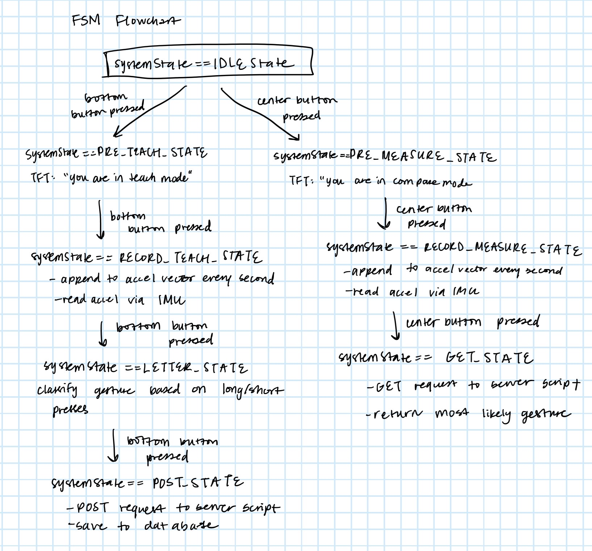

# Overview

For my design exercise, I implemented a gesture recognition system that recognizes the five vowels - a, e, i, o, u - and the letter y. The system has two modes: teach mode and compare mode. In teach mode, the user can record a gesture, label it with the corresponding letter, and save to the database. In compare mode, the user can record a gesture, and the system returns the closest saved letter.

I began by drafting an FSM diagram as shown below:



The system starts in IDLE_STATE where the TFT display gives the user instructions. The user can decide whether they'd like to teach a gesture or compare a gesture. The user has two options for next steps:

- Bottom button - systemState = PRE_TEACH_STATE
- Top button - systemState = PRE_MEASURE_STATE

In this way, the user progresses through the flow outlined in the FSM flowchart.

Most of my design thought went into the RECORD_TEACH_STATE, RECORD_MEASURE_STATE, LETTER_STATE, GET_STATE, and POST_STATE. I will elaborate on these:

In RECORD_TEACH_STATE and RECORD_MEASURE_STATE, I needed to record the device's motion over a period of time. To do this, I needed to sample the IMU's acceleration values every set interval (I chose a second). I got the z acceleration value every second and appended it to a char array holding the history of acceleration values. The code looked like this:

```cpp
//get accels continuously
imu.readAccelData(imu.accelCount);
x = imu.accelCount[0] * imu.aRes; 
y = imu.accelCount[1] * imu.aRes; 
z = imu.accelCount[2] * imu.aRes; 

//just store z vals
sprintf(curr_z, "%f, ", z);
strcat(z_arr, curr_z);
Serial.printf("current z vec is %s \n", z_arr);

while (millis() - primary_timer < LOOP_PERIOD); //wait for primary timer to increment
primary_timer = millis();

```
In LETTER_STATE, I needed to design a way for the user to indicate which letter they just trained the system to recognize. I decided to implement a scheme where short presses and long presses of the 3 buttons signify the 6 different possible letter options. The code is shown below for the top button (detects 'A' and 'E'):

```cpp
if (topButtonState==UNPRESSED && topButton==0) {
    topButtonState = PRESSED;
    Serial.println("TOP BUTTON HAS BEEN PRESSED");
    button_start_time = millis();
}      
else if (topButtonState==PRESSED && topButton==1) {
    topButtonState = UNPRESSED;
    systemState = POST_STATE;
    if (millis() - button_start_time >= long_press_duration) {
        Serial.println("long press detected");
        strcpy(letter, "E");
    }
    else {
        strcpy(letter, "A");
    }
    tft.fillScreen(TFT_BLACK); //fill background
}

```
In GET_STATE, I wanted to implement a GET request to my server script. I wanted to send the newly recorded user gesture acceleration values, compare it to the stored database gestures, and return the closest gesture. To do this, I implemented the following in my server-side code:

```cpp

if request["method"] == "GET":
    //only showing A for clarity, but did this for all letters
    try:
        accels = str(request['values']['accels'])
        stored_accels = getalldata()
        A_sig = list(stored_accels[0][0][0].split(", "))
        accel_sig = list(accels.split(", "))
        if len(A_sig)>10:
            A_sig = [float(x) for x in A_sig[0:len(A_sig)-1]]
        else:
            A_sig = [float(x) for x in A_sig]

        if len(accel_sig)>10:
            accel_sig = [float(x) for x in accel_sig[0:len(accel_sig)-1]]
        else:
            accel_sig = [float(x) for x in accel_sig]

        if len(accel_sig)<len(A_sig):
            A_sig = A_sig[0:len(accel_sig)]
            corrA = correlation(A_sig, accel_sig)
        else:
            corrA = correlation(A_sig, accel_sig[0:len(A_sig)])
        
        maxcoor = max(corrA, corrE, corrI, corrO, corrU, corrY)

        if maxcoor==corrA:
            return 'A'
```

The correlation() function being used in the code above was taken from an exercise that I previously completed.

Lastly, in POST_STATE, I wanted to save the user-trained gesture and the letter classification to the database. To do this, I needed to do a POST request to my server script. I implemented this functionality like this:

```cpp
elif request["method"]=="POST":
    try:
        accels = str(request['form']['accels'])
        letter = str(request['form']['letter'])
        create_database()
        x = getalldata()
        if len(x[0])==0:
            initialize()
        else:
            update(accels,letter)

        return 'success'

    except Exception as e:
        return 'error: ' + str(e)
```

My database included two fields - acceleration and letter. Both are text fields, but before any processing or comparison is done with the acceleration data, the string is converted into a list of floats.

My demonstration video is shown below:

[demonstration video](https://www.youtube.com/watch?v=rKieoc9K6Qs)


# Summary

Overall, my system implements all specific components:

- Allows teaching and long-term storage of 2D movements
- Allows comparison of unknown user gesture inputs
- Exists in a fully operational single script

The system can recognize six different movements and provides an intuitive mechanism for the user. Through the use of several 6.08 skills - IMU integration, correlation calculation, server side work, database design, etc. - an accurate gesture recognition system comes together.

Thank you for reviewing my design exercise!